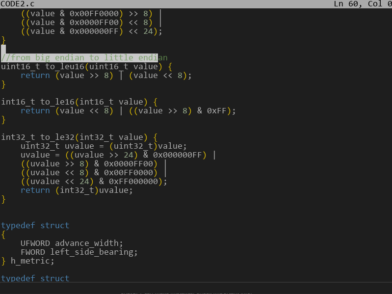
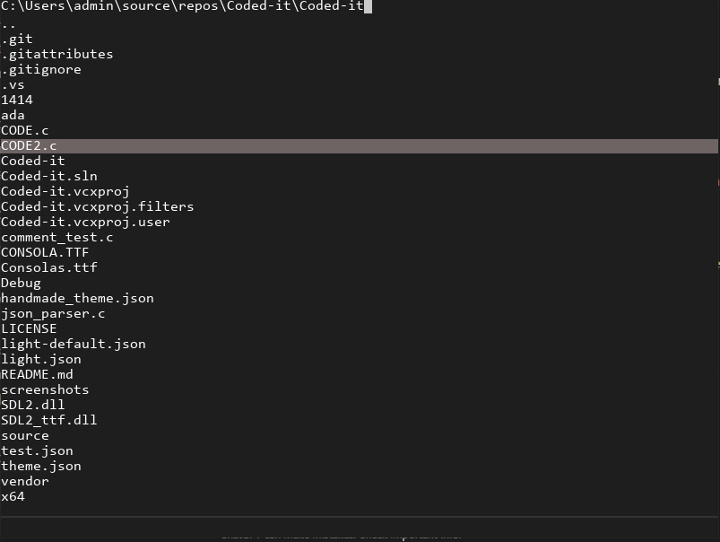
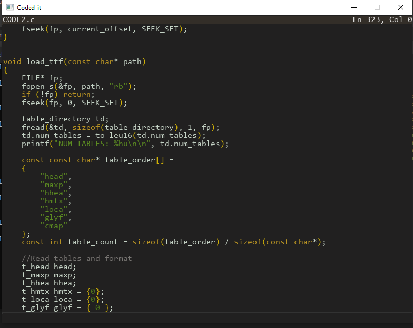

# Coded-it 

A Fast, Powerful Code editor for.. everyone... but mainly for C programmers.

#### NOTE!

Still in very early development.

# How It's Made:

**Tech used:** C, SDL2

Written in C from scratch using only SDL2 as a platform layer.
Everything here from json parsing to alpha blending is handwritten from scratch.
No bloat. Pure code.

# Current state 

- Basic Support for VS code themes
- File IO with a file explorer
- Standard text handling (navigation, selection, undo redo, etc) 
- Message system
- UI elements (Status bar, Buttons etc)
- Syntax highlighting

# Planned Features

- More advanced complex syntax highlighting (Highlighting language specific structures like function calls)
- More complex text handling (Vim keybinds. Custom keybinds)
- Terminal integration
- Extensible configuration

And many more features.

# Screenshots

